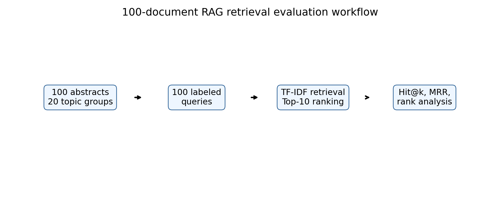
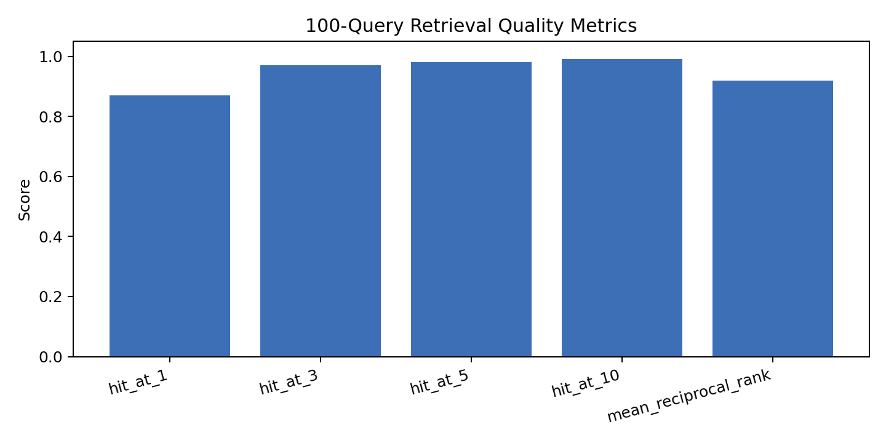
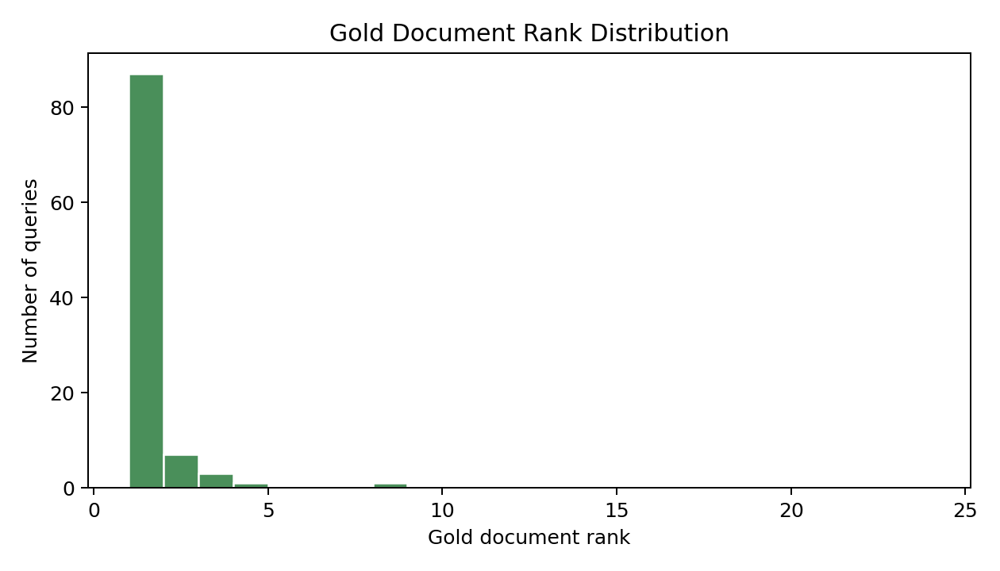
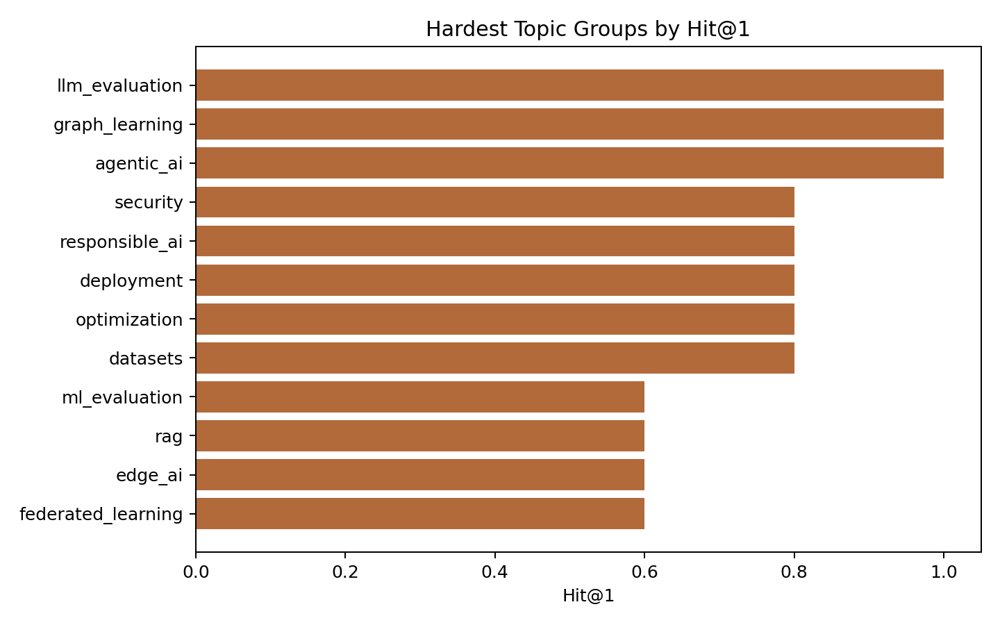

# 100-Document RAG Retrieval Evaluation



Figure: a RAG-style retrieval benchmark with 100 abstracts, 100 labeled queries, TF-IDF ranking, and hit@k evaluation.

## Motivation

Retrieval augmented generation depends on retrieval quality. If the retriever gives the wrong document, the final answer may be unsupported even if the language model sounds confident. For that reason, a RAG project should report retrieval metrics, not only example outputs.

## Project Goal

We built a RAG-style retrieval pipeline and evaluated whether the correct document appears in the top retrieved results.

## Dataset

The corpus contains 100 short AI research abstracts across 20 topic groups. The topics include federated learning, edge AI, model compression, computer vision, object detection, RAG, LLM evaluation, agentic AI, graph learning, responsible AI, deployment, security, optimization, reinforcement learning, and multimodal AI.

The query set contains 100 labeled questions. Each query has one gold document ID.

## Tools

Python, pandas, scikit-learn, and matplotlib.

## Method

We used TF-IDF with unigram and bigram features. For each query, we ranked all documents by cosine similarity and evaluated whether the gold document appeared in the top results.

## Metrics

- Hit@1: gold document is ranked first
- Hit@3: gold document appears in the top 3
- Hit@5: gold document appears in the top 5
- Mean reciprocal rank: average reciprocal rank of the gold document

## Results

| Metric | Value |
|---|---:|
| Documents | 100 |
| Queries | 100 |
| Topic groups | 20 |
| Hit@1 | 0.8700 |
| Hit@3 | 0.9700 |
| Hit@5 | 0.9800 |
| Hit@10 | 0.9900 |
| Mean reciprocal rank | 0.9189 |
| Mean gold rank | 1.9700 |







Result files:

- `results/abstract_corpus.csv`
- `results/query_set.csv`
- `results/rag_retrieval_results.csv`
- `results/retrieval_metrics_by_query.csv`
- `results/retrieval_summary.csv`
- `results/retrieval_summary_by_topic_group.csv`

## Interpretation

The retriever works well but is not perfect. Hit@1 is 0.8700, so most queries retrieve the correct document first. Hit@3 rises to 0.9700, which shows why RAG systems usually pass several retrieved documents to the answer generator instead of trusting only the top document.

The remaining misses are useful. They happen when nearby AI topics share vocabulary, for example compression, deployment, evaluation, and security. This is exactly where dense retrieval, reranking, or better query expansion may help.

## Conclusion

This project evaluates retrieval quality directly on a 100-document AI corpus. TF-IDF is a strong baseline for short technical abstracts, but the non-perfect Hit@1 result shows that a serious RAG system should track retrieval metrics and compare lexical retrieval against embedding retrieval and reranking.

## How To Run

```bash
pip install -r requirements.txt
python 1_tiny_rag_pipeline.py
```
